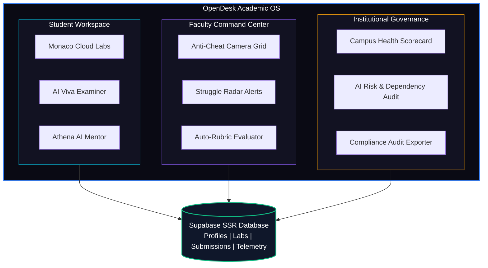

# OpenDesk — AI-Powered Academic Intelligence Platform

<div align="center">


**Behavior-Aware Practical Learning & AI Governance Ecosystem**

[**Live Web Application**](https://open-desk-8yxb.vercel.app/) • [**Architecture Deep-Dive**](#system-architecture--subsystems) • [**Quick Start**](#quick-start-guide)

</div>

---

## Primary Author & Lead Architect

* **D Karthik Raj** ([@dkarthikraj](https://github.com/dkarthikraj))
  * **Email**: `dkarthikraj18@gmail.com`
  * **Role**: Primary Author, System Architect & Lead Developer

---

## Executive Overview

**OpenDesk** is a next-generation academic operating system designed to bridge the gap between practical engineering education, AI-assisted learning, and institutional academic governance. 

Traditional learning management systems (LMS) treat practical lab work as static code dropboxes. OpenDesk reimagines practical learning into a **behavior-aware, real-time cognitive feedback network**. By tracking student focus continuity, time-to-first-compile, struggle indices, and reasoning pathways during lab sessions, OpenDesk provides students with personalized Socratic guidance while equipping faculty with real-time class intelligence and struggle radar alerts.

---

## System Architecture & Subsystems



### 1. Student Virtual Battlestation

- **Integrated Monaco Code Editor**: Full-featured browser IDE supporting multi-language syntax highlighting, real-time error diagnostics, and autosave.
- **Behavioral Focus Tracker**: Monitors user event cadences (key strokes, idle durations, tab switches) to compute real-time cognitive load metrics without intrusive telemetry.
- **Adaptive Learning DNA**: Computes individual student mastery vectors across Data Structures, Algorithms, Systems Programming, and Web Engineering.

### 2. AI Viva Voice Examination Engine
- **Voice & Text Simulator**: Conducts structured 15-minute practical viva sessions with adaptive question difficulty based on student submission code.
- **Real-Time Confidence Scoring**: Analyzes response depth, technical terminology precision, and resolution clarity to calculate a live Confidence Index (0–100%).
- **Socratic Counter-Questioning**: Evaluates student edge-case understanding rather than memorized code syntax.

### 3. Athena 24/7 Context Academic Mentor
- **Context-Aware Debugging Assistant**: Powered by OpenAI GPT-4o with custom system prompts that prevent direct code dumping, encouraging students to solve bugs independently.
- **Session Memory & Progress Tracking**: Remembers prior student struggles across lab modules to deliver tailored hints.

### 4. Faculty Command Center
- **Live Class Anti-Cheat Monitoring**: Real-time grid displaying student focus states, active line numbers, and struggle indicators during live lab hours.
- **Automated Rubric Evaluation**: Instant automated test-case runner with objective rubric scoring.
- **One-Click Broadcast Intervention**: Allows faculty to push contextual hints or problem clarifications directly to student terminals simultaneously.

### 5. Institutional AI Risk & Governance Dashboard
- **Campus-Wide AI Dependency Analytics**: Audits student reliance on AI tools vs independent problem-solving across departments.
- **Plagiarism & Anomaly Flagging**: Highlights unusual velocity jumps or copy-paste surges across cohorts.
- **One-Click Institutional Compliance Reporting**: Exports standardized audit reports for accreditation bodies (NBA, NAAC, VTU).

---

## Technical Stack & Dependencies

| Component | Technology | Description |
| :--- | :--- | :--- |
| **Framework** | Next.js 16.2.6 (Turbopack) | App Router architecture with SSR & static optimization |
| **UI Engine** | React 19 & Tailwind CSS v4 | High-density dark glassmorphism design system |
| **Database & Auth** | Supabase SSR (`@supabase/ssr`) | PostgreSQL database with Row Level Security (RLS) |
| **Code Editor** | Monaco Editor | `@monaco-editor/react` integration for cloud lab IDE |
| **Visualizations** | Recharts & Framer Motion | Smooth 60fps cognitive load charts and animated UI state transitions |
| **AI Processing** | OpenAI GPT-4o API | Contextual viva voice examination & Socratic mentoring |

---

## Database Schema Model (Supabase SQL)

OpenDesk relies on a relational schema in PostgreSQL:

- **`profiles`**: User metadata, system role (`student`, `faculty`, `admin`), department, and CGPA.
- **`labs`**: Course lab challenges, problem statements, starter code templates, and difficulty tiers.
- **`lab_submissions`**: Student code submissions, execution test results, score rubrics, and focus scores.
- **`viva_sessions`**: Oral exam logs, generated questions, student answers, and confidence ratings.
- **`behavioral_logs`**: Focus continuity telemetry, struggle flags, and time-to-first-compile events.

---

## Environment Configuration

Create a `.env.local` file in the root directory:

```env
# Supabase Configuration
NEXT_PUBLIC_SUPABASE_URL=https://your-supabase-project.supabase.co
NEXT_PUBLIC_SUPABASE_ANON_KEY=your-supabase-anon-key

# OpenAI API Key (AI Viva & Mentor Chat)
OPENAI_API_KEY=your-openai-api-key
```

---

## Quick Start Guide

### Prerequisites
- Node.js v18.0 or higher
- npm or pnpm

### Installation Steps

1. **Clone Repository**:
   ```bash
   git clone https://github.com/dkarthikraj/Open-Desk.git
   cd Open-Desk
   ```

2. **Install Dependencies**:
   ```bash
   npm install
   ```

3. **Run Development Server**:
   ```bash
   npm run dev
   ```

4. **Access Platform**:
   Open [http://localhost:3000](http://localhost:3000) in your browser.

---

## Deployment Workflows

### Vercel Deployment (Recommended)
This repository is configured for automatic Vercel serverless deployment. Simply connect `dkarthikraj/Open-Desk` to Vercel at [vercel.com/new](https://vercel.com/new).

### GitHub Pages Static Export
The repository includes a static export pipeline targeting `./docs/` for GitHub Pages hosting:
```bash
npm run build
```

---

## License & Author

Designed & Maintained by **D Karthik Raj** ([@dkarthikraj](https://github.com/dkarthikraj)). Licensed under the [MIT License](LICENSE).

